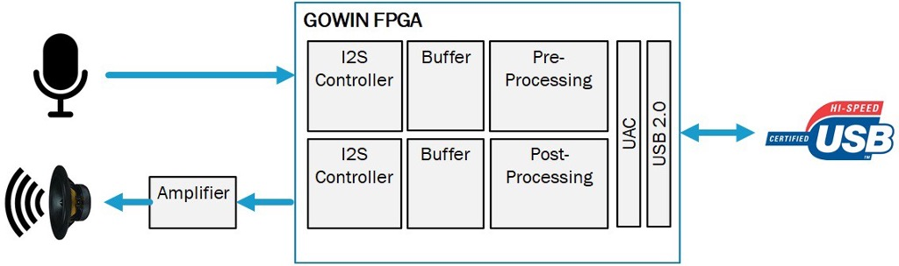

Welcome to GOWIN's open source UAC2 demo EDA project. 

The GOWIN USB Audio Class 2 (UAC2) reference design uses the following freely licensed Soft IP Cores,
USB2.0 Soft-PHY & USB2.0 Controller, I2S RX & TX with control logic via USB HID (Human Interface Device).
Providing a starting point for customers to develop custom low-cost USB Audio applications using GOWIN FPGA.

GOWIN UAC2 (USB Audio Class) to I2S Reference Design

### UAC2 Features:

## USB2.0
* Fully Certified USB2.0 implements the USB-PHY on-chip using GOWIN’s patented Soft-Core IP.
## Data Widths
* Supports 16-bit, 24-bit and 32-bit data.
## Audio Sample Rates
* 768KHz, 705.6KHz, 384KHz, 352.8KHz, 192KHz, 176.4KHz, 128KHz, 96KHz, 88.2KHz, 64KHz, 48KHz, 44.1KHz and 32KHz
## Data Formats
* PCM with other formats coming soon.
## Low Latency
* Maximum latency is ~125us (1 high-speed frame).
* Well within the 500uS required by the UAC2 standard.
## Configurable Buffer Size
* The UAC Ref Design Left & Right Audio channels are each allocated a 1024 Byte buffer by default.
## Audio Channels 
* The reference design supports UAC2 2x2 with UAC2 4x4 coming soon.
## Clocking Scheme
* Asynchronous mode, with the clocks derived from an external crystal oscillator.

You can download GOWIN's needed version of EDA (Gowin_V1.9.9) for this project here: https://www.gowinsemi.com/en/support/download_eda/
